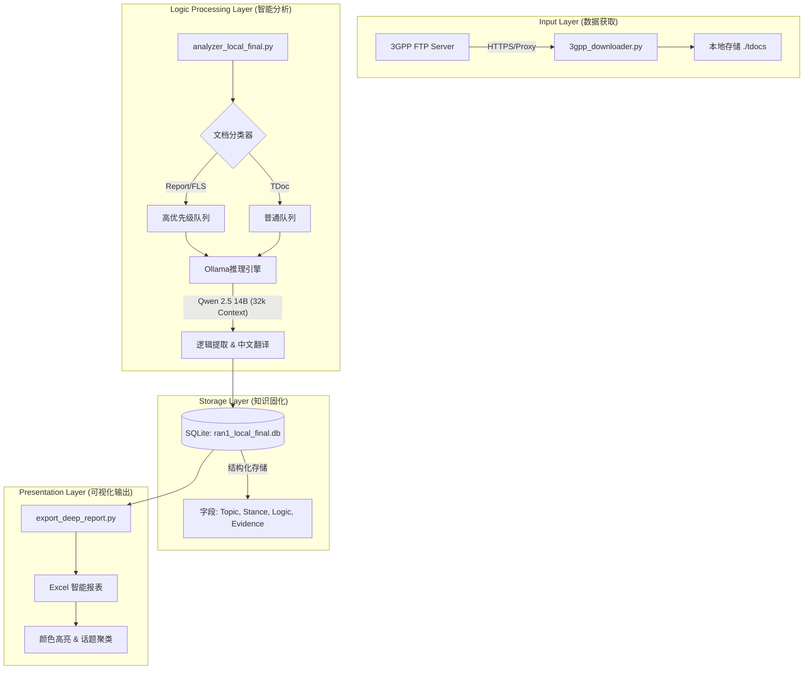

这是一份为您量身定制的 **DeepSpec 3.0 系统架构与实现白皮书**。

这份文档将我们过去几天所有的探索、调试和优化，固化为一套标准的工程方案。它不仅解释了代码怎么写，更解释了**为什么要这么设计**。

-----

# DeepSpec 3.0：下一代 3GPP 标准情报洞察系统

**System Architecture & Implementation Design Document**

**版本：** v3.0 (Local-First Edition)
**适用硬件：** Apple Silicon (M4 Pro/Max recommended)
**核心引擎：** Qwen 2.5 (14B) + Python Ecosystem

-----

## 1\. 项目背景与痛点 (Background & Pain Points)

3GPP 标准制定是一个海量信息博弈的过程。传统的人工阅读和简单的关键词搜索面临以下瓶颈：

1.  **碎片化严重：** 一个技术点（如 AI/ML 空口）散落在上千篇 TDoc 中。
2.  **逻辑黑箱：** 只看“结论”（Proposal）无法理解背后的“推导逻辑”（Reasoning）和数据支撑。
3.  **语言壁垒：** 高强度的英文长难句阅读极易造成疲劳和误读。
4.  **缺乏全局观：** 容易陷入细节，忽视了 Chairman Report 和 Feature Lead Summary 定义的宏观战场格局。

**DeepSpec 3.0** 旨在通过本地大模型技术，构建一个**自动化的、有逻辑深度的、中文原生的**标准情报分析师。

-----

## 2\. 系统核心设计理念 (Core Philosophy)

### 2.1 上帝视角优先 (Top-Down Processing)

系统不再乱序读取文档，而是遵循严格的**权力金字塔**顺序处理，确保数据库 ID 的顺序即为逻辑权重的顺序：

[Image of pyramid hierarchy structure]

  * **Tier 1 (顶层):** Chairman Notes / Minutes (定义结论与方向)
  * **Tier 2 (中层):** Feature Lead Summary (FLS) (定义争议点与阵营)
  * **Tier 3 (底层):** Regular TDocs (提供具体技术细节与仿真数据)

### 2.2 逻辑大于结论 (Reasoning over Conclusion)

单纯提取“支持/反对”是廉价的。本系统专注于提取 **`Reasoning Logic` (推导链)** 和 **`Evidence` (证据链)**，即回答“为什么华为/高通会这么提议？”

### 2.3 本地隐私与效率 (Local-First)

利用 Mac M4 芯片的统一内存架构，部署 Qwen 2.5 (14B) 模型，实现 **0 成本、无网络依赖、无数据泄露风险** 的全量分析。

-----

## 3\. 系统总体架构 (System Architecture)



-----

## 4\. 关键功能模块详解

### 4.1 智能获取模块 (`3gpp_downloader.py`)

  * **功能：** 解决 3GPP FTP 的 SSL 证书报错问题，支持 SOCKS/HTTP 代理。
  * **特性：** 多线程并发下载，自动解压 ZIP，自动清理垃圾文件，支持断点续传。

### 4.2 深度分析引擎 (`analyzer_local_final.py`)

这是系统的核心大脑。

  * **模型选型：** **Qwen 2.5 - 14B**。
      * *理由：* 在 M4 Max 上推理速度约 40-60s/篇，比 32B 快 3 倍，且逻辑能力足够。
  * **Prompt 工程：**
      * **多观点提取：** 强制输出 `JSON Array`，一篇文档提取 N 个技术点。
      * **中文原生：** 指令模型 *"Read English, Think in Logic, Output in Simplified Chinese"*。
      * **逻辑闭环：** 专门提取 `Observation -> Analysis -> Proposal` 链条。
  * **冷却策略：** 本地模式火力全开，无冷却时间（Sleep = 0）。

### 4.3 智能报表生成器 (`export_deep_report.py`)

将数据库转化为人类可读的决策辅助工具。

  * **话题聚类：** 自动将同一 Topic（如 DMRS）下的所有厂商观点聚在一起。
  * **视觉分层：**
      * 🔴 **深红色/高亮：** Chairman Report (一锤定音)
      * 🟢 **深绿色/高亮：** FLS Summary (战场态势)
      * ⚪ **普通白色：** 各厂提案 (具体细节)

-----

## 5\. 项目文件结构 (Directory Structure)

```text
DeepSpec/
├── tdocs/                  # [自动生成] 存放下载的 Word 文档
│   ├── R1-2501234.docx
│   └── ...
├── ran1_local_final.db     # [自动生成] 核心数据库 (SQLite)
├── DeepSpec_Report.xlsx    # [自动生成] 最终 Excel 报表
├── requirements.txt        # 依赖库列表
├── 3gpp_downloader.py      # 模块1: 下载器
├── analyzer_local_final.py # 模块2: 分析器 (核心)
└── export_deep_report.py   # 模块3: 报表导出
```

-----

## 6\. 部署与运行指南 (Deployment Guide)

### 环境准备

1.  **安装 Python 依赖：**
    ```bash
    pip install -r requirements.txt
    ```
2.  **准备模型 (Ollama)：**
    ```bash
    ollama pull qwen2.5:14b
    ```

### 运行步骤

#### Step 1: 数据获取

下载目标会议（如 RAN1 \#123）的所有文档。

```bash
python 3gpp_downloader.py
```

*(注：请在脚本中配置好 `TARGET_URL` 和 `PROXY_PORT`)*

#### Step 2: 深度分析 (挂机运行)

启动本地大模型进行全量分析。建议在下班前启动，挂机过夜。

```bash
python analyzer_local_final.py
```

  * **预期耗时：** 1000 篇文档约需 12-15 小时。
  * **断点续传：** 如果中断，再次运行会自动跳过已完成的文件。

#### Step 3: 生成情报报表

分析完成后，一键生成 Excel。

```bash
python export_deep_report.py
```

打开生成的 `.xlsx` 文件，你将看到一个按话题排列、中文呈现、逻辑清晰的 3GPP 战场全景图。

-----

## 7\. 未来演进规划 (Roadmap)

  * **v3.1 (RAG 增强):** 引入向量数据库，允许用户用自然语言提问（“查询所有关于 DMRS 导频密度的反对意见”）。
  * **v3.2 (图谱可视化):** 利用提取的 `Related Docs` 字段，绘制提案引用关系拓扑图，自动识别“意见领袖”和“孤立节点”。
  * **v3.3 (多模态):** 尝试引入视觉模型（Vision Model），直接读取文档中的 Figure 曲线图并转化为数据表格。

-----

### 附录：数据字典 (Database Schema)

| 字段名 | 类型 | 描述 | 示例 |
| :--- | :--- | :--- | :--- |
| `doc_type` | TEXT | 文档层级 | `Chairman_Report` |
| `topic` | TEXT | 技术话题 | `AI/ML Air Interface` |
| `vendor` | TEXT | 厂商 | `Huawei` |
| `stance` | TEXT | 立场 | `支持` |
| `proposal_content`| TEXT | 提案结论 | `建议采用 Type 1 码本` |
| **`reasoning_logic`**| TEXT | **推导逻辑** | `仿真显示 Type 2 在高速场景下性能下降 3dB` |
| `evidence_desc` | TEXT | 证据描述 | `图 4 系统级仿真结果` |

-----

这份文档现在不仅记录了**如何做**，更体现了**DeepSpec** 作为一个专业情报系统的价值。你可以将其保存为 `README.md` 或 PDF，作为项目的核心资产。
